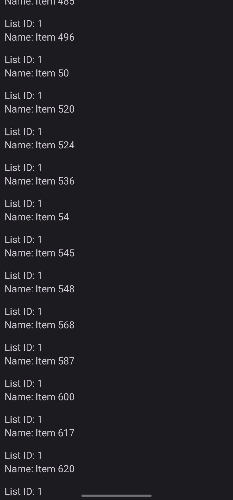
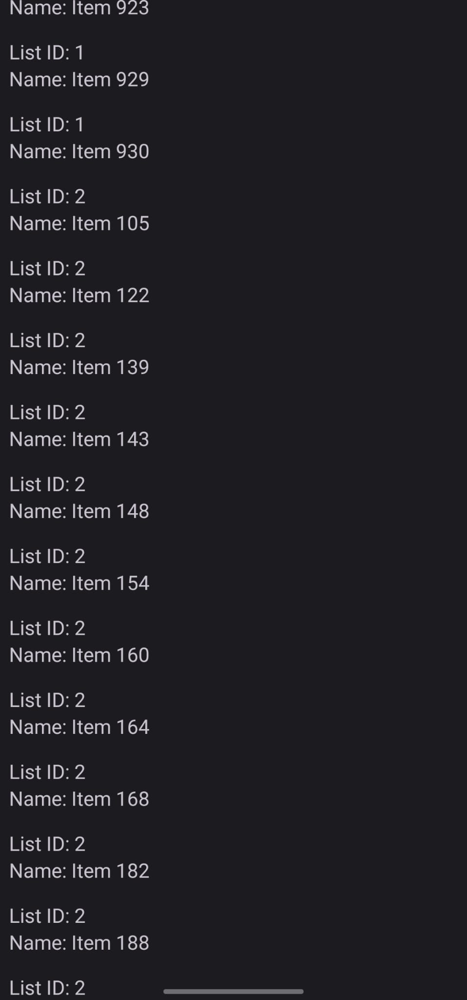

# FetchData

## Overview
This Android application fetches and displays a list of items from a remote JSON API. It demonstrates basic usage of RecyclerView, ViewModel, LiveData, and network operations using AsyncTask.

## Features
Fetches JSON data from a remote API endpoint. \
Displays a list of items in a RecyclerView.

## Technologies Used
Android SDK \
Java \
XML (for layout)

## Installation
Clone the repository. \
Open the project in Android Studio. \
Build and run the application on an Android device or emulator. 

## Usage
Launch the application. \
View the list of items fetched from the API. \
Scroll through the list to see all items. 

## Output
 \

